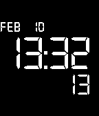

BN0046
======

The classy and elegant Braun BN0046 watch converted to a Pebble watchface.

##Credits

To do the SDK 2.0 compatible version, I learned a lot from <a href="https://github.com/C-D-Lewis">C-D-Lewis</a> and his <a href="http://ninedof.wordpress.com/">blog</a>, so check them out!

The SDK1.0 version was heavily based on the <a href="http://github.com/jpgarretson/LCD">LCD</a> by <a href="http://github.com/jpgarretson">jpgarretson</a>, so, kudos to him! It was a great ground to learn and develop this watchface.

I also use a custom <a href="http://adamwhitcroft.com/climacons/">Climacons</a> font  created in the excelent <a href="http://icomoon.io/app/">IcoMoon App</a>
